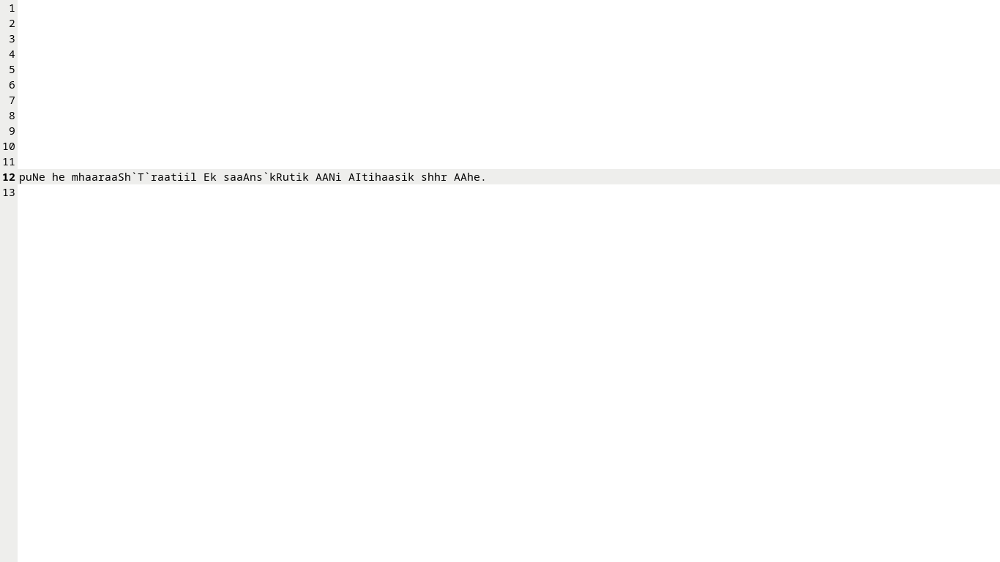

# 🌐 Devanagri to ASSCI — Bidirectional Transliteration Engine (Devanagari ↔ ASCII)

### 🧠 Overview
**Devanagri to ASSCI** is a lightweight bidirectional transliteration engine built entirely using **Linux shell scripting and `sed`**.  
It converts text between **Devanagari script** (e.g., Hindi/Marathi) and **ASCII-based phonetic representation** without using any external libraries or compilers.

---

## ⚙️ How It Works

The project consists of two transliteration modules:
1. **ASCII → Devanagari**  
   Converts ASCII text (Romanized Hindi/Marathi) into proper Devanagari Unicode script.  
2. **Devanagari → ASCII**  
   Converts native Devanagari text into its ASCII phonetic equivalent.

Each module executes a multi-step transformation using Linux tools and pipelines:

| Stage | Tool Used | Purpose |
|--------|------------|----------|
| 1️⃣ | `sed` | Replace ASCII tokens with equivalent Unicode hex |
| 2  | `cat` / `echo` | Stream input/output between stages |
| 3 | Custom `sed` maps | Apply linguistic rules for syllable formation |
| 4 | Output redirect | Produce transliterated result as text |

---

## 🧩 Folder Structure

Devanagari-ASCII-Transliteration-using-Sed/
│
├── ASSCI_to_Devnagari/
│ ├── input # ASCII input text
│ ├── out # Devanagari output text
│ ├── AsscitoBin # Converts ASCII → Binary
│ ├── bintouni # Converts Binary → Unicode
│ ├── Unitodev # Converts Unicode → Devanagari
│ ├── ENG_DEV # sed mapping rules
│ ├── Demo_Devanagri_input.png
│ ├── Demo_ASSCI_OutPut.png
│ └── README.md
│
├── Devnagari_to_ASSCI/
│ ├── input # Devanagari input text
│ ├── out # ASCII transliterated output
│ ├── devtoUni # Converts Devanagari → Unicode
│ ├── Unitobin # Converts Unicode → Binary
│ ├── AsscitoBin # Converts ASCII → Binary (cross-verification)
│ ├── DevToEng # sed rules for Dev → ASCII mapping
│ └── README.md
│
├── Demo_Devanagri_input.png
├── Demo_ASSCI_OutPut.png
├── Mapping_file
└── README.md # Main documentation

---
## 🔡 Character Mapping (Devanagari ↔ ASCII)

The transliteration engine uses a **custom key mapping** stored in the file `New_keymapping`,  
which defines one-to-one mappings between **ASCII tokens**, their **Unicode points**, and **Devanagari characters**.

Each rule is processed using `sed` to replace ASCII tokens with their respective Devanagari symbols  
(or vice versa during reverse transliteration).

### 📘 Mapping Overview

| ASCII Token | Devanagari | Unicode (Hex) | Description |
|--------------|-------------|---------------|--------------|
| `A` | अ | `U+0905` | Short vowel ‘a’ |
| `AA` | आ | `U+0906` | Long vowel ‘aa’ |
| `I` | इ | `U+0907` | Short vowel ‘i’ |
| `II` | ई | `U+0908` | Long vowel ‘ii’ |
| `U` | उ | `U+0909` | Short vowel ‘u’ |
| `UU` | ऊ | `U+090A` | Long vowel ‘uu’ |
| `RU` | ऋ | `U+090B` | Vocalic ‘r’ |
| `k` | क | `U+0915` | Velar consonant |
| `kh` | ख | `U+0916` | Aspirated velar |
| `g` | ग | `U+0917` | Voiced velar |
| `gh` | घ | `U+0918` | Voiced aspirated |
| `c` / `ch` | च | `U+091A` | Palatal stop |
| `j` | ज | `U+091C` | Palatal voiced |
| `t` | त | `U+0924` | Dental stop |
| `th` | थ | `U+0925` | Aspirated dental |
| `d` | द | `U+0926` | Voiced dental |
| `dh` | ध | `U+0927` | Voiced aspirated |
| `n` | न | `U+0928` | Nasal |
| `p` | प | `U+092A` | Bilabial stop |
| `ph` | फ | `U+092B` | Aspirated bilabial |
| `b` | ब | `U+092C` | Voiced bilabial |
| `bh` | भ | `U+092D` | Voiced aspirated |
| `m` | म | `U+092E` | Nasal bilabial |
| `y` | य | `U+092F` | Semivowel |
| `r` | र | `U+0930` | Liquid consonant |
| `l` | ल | `U+0932` | Lateral consonant |
| `v` | व | `U+0935` | Labio-dental |
| `sh` | श | `U+0936` | Palatal fricative |
| `Sh` | ष | `U+0937` | Retroflex fricative |
| `s` | स | `U+0938` | Dental fricative |
| `h` | ह | `U+0939` | Glottal sound |
| `aa` | ा | `U+093E` | Vowel sign ‘aa’ |
| `i` | ि | `U+093F` | Vowel sign ‘i’ |
| `ii` | ी | `U+0940` | Vowel sign ‘ii’ |
| `u` | ु | `U+0941` | Vowel sign ‘u’ |
| `uu` | ू | `U+0942` | Vowel sign ‘uu’ |
| ``` ` ``` | ् | `U+094D` | Halant / Virama |
| `|` | । | `U+0964` | Danda (full stop) |
| `||` | ॥ | `U+0965` | Double danda |
| `0–9` | ०–९ | `U+0966–U+096F` | Devanagari digits |

### 🔍 Notes
- Mappings are **bidirectional**, meaning the same table is used for both conversions:
  - `ASCII → Devanagari` via pattern substitution.
  - `Devanagari → ASCII` via reverse lookup.
- The full Unicode range `U+0900–U+097F` is supported, including nukta, vowel signs, and symbols.
- All mappings are applied sequentially using `sed` scripts for efficient transformation.

To view the complete mapping list, see [`New_keymapping`](./New_keymapping).

---

### 🧪 Example of Mapping in Use

```bash
# Inside sed rule file (ENG_DEV)
s/A/अ/g
s/AA/आ/g
s/I/इ/g
s/II/ई/g
s/k/क/g
s/kh/ख/g
s/g/ग/g
s/gh/घ/g
s/t/त/g
s/th/थ/g
s/d/द/g
s/dh/ध/g
```

---
## 🧠 Concept & Motivation

- This project demonstrates low-level text processing and memory-efficient transliteration using only Linux shell tools.
Key goals:

- Implement encoding logic without C/Python libraries.

- Understand binary ↔ Unicode ↔ glyph conversion.

- Explore how language scripts can be represented purely by substitution logic and bit-level encoding.

---

## 📘 Example Output
```bash
- Input (ASCII → Devanagari)
  puNe he mhaaraShT`raatiil Ek saaAns`kRutik AANi AItihasik shhr AAhe.

- Output
 पुणे हे महाराष्ट्रातील एक सांस्कृतिक आणि ऐतिहासिक शहर आहे.
```
---

## 🖼️ Demo Screenshots

| Devanagari Input | ASCII Output |
|------------------|--------------|
|  |  |
